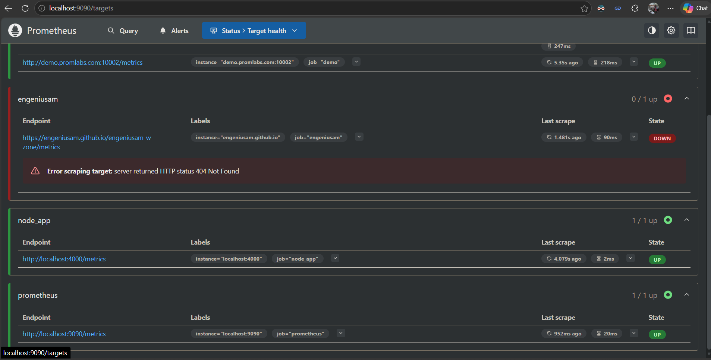

# Docker Tutorial Node.js App with Prometheus Metrics

This repository contains a simple Node.js application that exposes Prometheus metrics via `/metrics`, and a Dockerfile to build and run it inside a container.

## What this app does

- Runs an Express server on port `4000`
- Uses `prom-client` to expose Prometheus-compatible metrics
- Increments a counter for every incoming HTTP request
- Serves metrics at `http://localhost:4000/metrics`

## Files

- `server.js` - Node.js application code
- `Dockerfile` - Docker image build instructions
- `.dockerignore` - ignored files when building the image
- `package.json` / `package-lock.json` - Node package metadata

## Run the app locally

Install dependencies and start the app:

```bash
npm install
npm start
```

Then open:

```text
http://localhost:4000/
```

And view metrics at:

```text
http://localhost:4000/metrics
```

## Build and run the Docker container

Build the Docker image:

```bash
docker build -t node-prometheus-app .
```

Run the container:

```bash
docker run --rm -p 4000:4000 node-prometheus-app
```

Then verify the app is reachable at `http://localhost:4000/`.

## Prometheus configuration for this app

The Node.js app exposes metrics on `/metrics`. Add a scrape configuration to your `prometheus.yml` like this:

```yaml
scrape_configs:
  - job_name: 'node_app'
    metrics_path: /metrics
    static_configs:
      - targets: ['localhost:4000']
```

If Prometheus is running in Docker and cannot reach `localhost` on the host directly, use one of these instead:

- `host.docker.internal:4000`
- the host machine IP address

## Observing metrics in Prometheus

Once Prometheus is running with the config above, open Prometheus in your browser (for example `http://localhost:9090`) and check:

1. The `Targets` page to confirm the `node_app` target is `UP`
2. The `Status` → `Targets` page to inspect scrape history and errors
3. The `Graph` page to query metrics like `http_requests_total`

Example Prometheus query:

```promql
http_requests_total
```

## What to look for in the screenshot

The attached image shows Prometheus target health and confirms that the Node.js app metrics endpoint at `http://localhost:4000/metrics` is being scraped successfully.



> If you want, save the screenshot to `prometheus-targets.png` in this repository so it displays directly in this README.

## Notes

- The metrics endpoint is implemented in `server.js` using `prom-client`.
- Prometheus scrapes metrics from `http://localhost:4000/metrics` by default.
- If you run Prometheus on a different machine or container, update the `targets` value accordingly.
